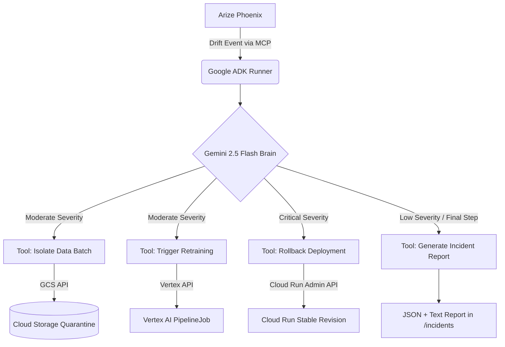

# AegisOps 

**Google Cloud Agent Hackathon 2026 Submission**

Monitoring is passive. Engineers still investigate and fix drift manually. 
**AegisOps** is the autonomous MLOps engineer — it detects, diagnoses, and acts.

Built with **Google ADK v2.2.0** and **Gemini 2.5 Flash**, AegisOps intercepts live telemetry from Arize Phoenix (via MCP) and autonomously triggers GCP remediation workflows.

---

##  Architecture

AegisOps operates on a strict *Observe → Reason → Act* loop.



##  Key Features

- **Zero Manual Intervention**: Replaces the PagerDuty → Investigation → Remediation cycle entirely.
- **Strict JSON Contracts**: Telemetry is parsed through a strict `DriftEvent` schema to prevent hallucinations.
- **Dual-Mode Tools**: Tools execute real GCP API calls when `GOOGLE_APPLICATION_CREDENTIALS` is present, but seamlessly fall back to mock mode for easy local demoing.
- **Exponential Backoff**: Built-in `@with_retry` decorator handles transient GCP API limits or networking blips.
- **Audit Trails**: Every action produces a timestamped, structured incident report.

---

##  Tech Stack

- **Agent Orchestration**: Google ADK (Agent Development Kit) v2.2.0
- **LLM Engine**: Gemini 2.5 Flash (fast reasoning)
- **Observability / Input**: Arize Phoenix (via MCP `StdioConnectionParams`)
- **Remediation Actions**: 
  - Google Cloud Storage (Batch isolation)
  - Vertex AI (Pipeline retraining)
  - Cloud Run (Traffic rollback)

---

##  Quickstart (Demo Mode)

You can run the agent locally without any GCP configuration. The tools will auto-detect the lack of credentials and run in **Mock Mode**, simulating the remediation actions.

### 1. Install Dependencies
```bash
python3 -m venv .venv
source .venv/bin/activate
pip install -r requirements.txt
```

### 2. Configure Environment
Create a `.env` file in the root:
```env
GOOGLE_GENAI_API_KEY=your_gemini_api_key
GOOGLE_API_KEY=your_gemini_api_key
```

### 3. Run the Interactive CLI Demo
```bash
python -m src.main
```
This boots the agent and presents 3 telemetry scenarios (Moderate Drift, Critical Degradation, Stable Operations). Choose one to watch Gemini reason and call the appropriate mock tools.

### 4. Run the ADK Web UI
Google ADK provides a beautiful chat interface out of the box:
```bash
adk web .
```
---

## Telemetry Pipeline Setup (Arize Phoenix)

Person 2's components — run these alongside the agent for live drift detection.

### Prerequisites
- Python 3.11+
- Node.js (for Phoenix MCP server)

### 1. Install Telemetry Dependencies
```bash
pip install arize-phoenix arize-phoenix-client opentelemetry-sdk opentelemetry-exporter-otlp
```

### 2. Start Arize Phoenix
```bash
python -m phoenix.server.main serve
```
Phoenix UI available at `http://localhost:6006`

### 3. Start Phoenix MCP Server
Open a new terminal:
```bash
npx -y @arizeai/phoenix-mcp@latest --baseUrl http://localhost:6006
```

### 4. Generate Synthetic Traces
```bash
python simulate_drift_scenarios.py
```
This logs 100 spans across 5 batches with severity levels: `none → low → moderate → critical`

### 5. Start the Drift Watcher
```bash
python pipeline.py
```
Polls Phoenix every 10 seconds. Writes `latest_drift_event.json` when drift is detected — P1's agent picks this up automatically.

### 6. Inject Live Drift (Demo)
In a separate terminal, re-run the simulation to trigger the autonomous loop:
```bash
python simulate_drift_scenarios.py
```

### Full Autonomous Loop
```
simulate_drift_scenarios.py → Phoenix captures traces
→ pipeline.py detects drift → writes latest_drift_event.json
→ P1's agent reads file → Gemini reasons → GCP tool fires
```
---

##  Live GCP Mode (Optional)

To execute real remediation actions:
1. Authenticate with Google Cloud:
   ```bash
   export GOOGLE_APPLICATION_CREDENTIALS=/path/to/service-account.json
   ```
2. Set your environment variables in `.env`:
   ```env
   GOOGLE_CLOUD_PROJECT=your-project-id
   GOOGLE_CLOUD_LOCATION=us-central1
   GCS_DATA_BUCKET=your-data-bucket
   VERTEX_PIPELINE_TEMPLATE=gs://your-bucket/template.json
   ```
3. Run the agent. The dual-mode tools will automatically detect the credentials and use the real APIs.

---

## License

MIT License — see [LICENSE](LICENSE) for details.